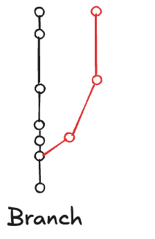
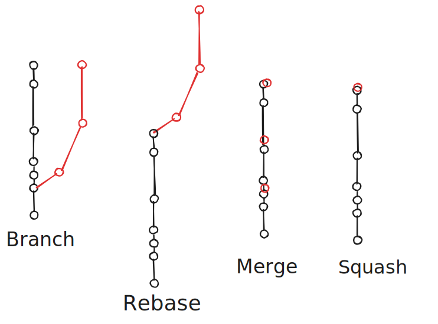
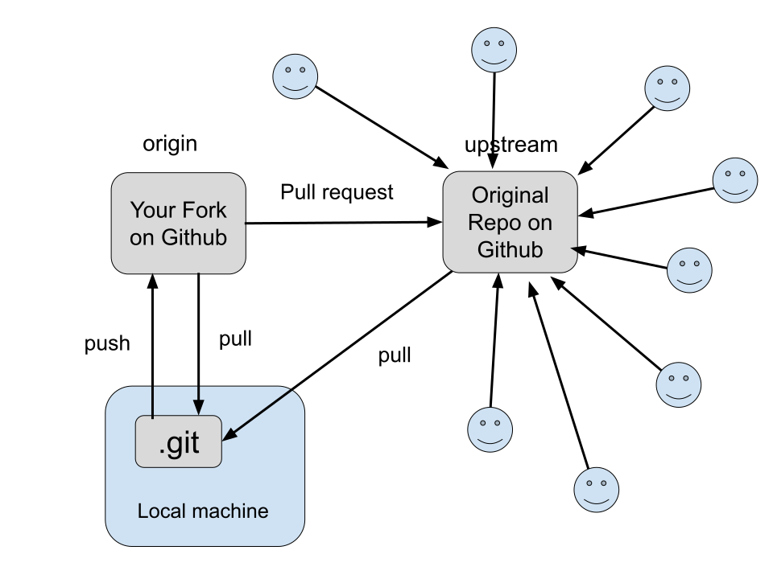
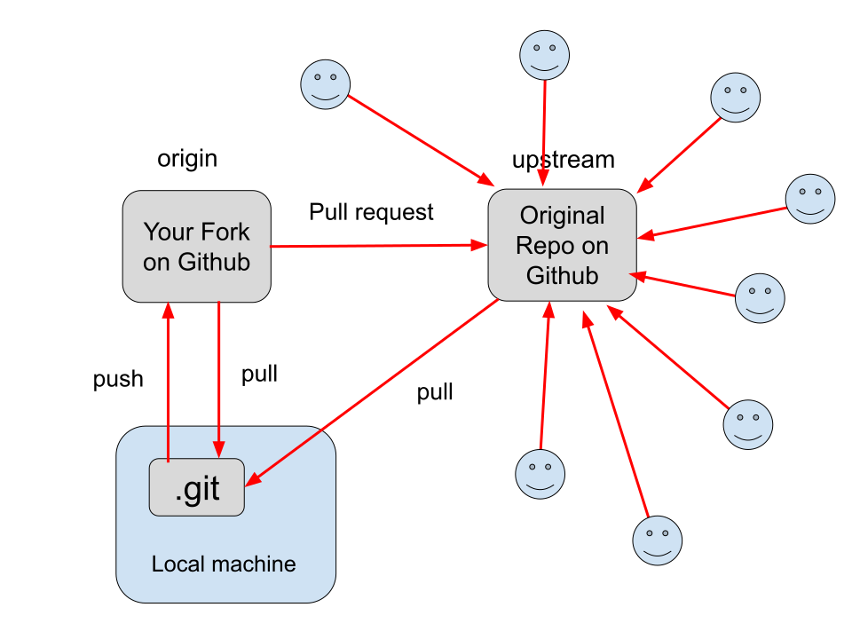

<!-- To build locally: 
cd slides
cat lecture.md participants.md > full.md; npx @marp-team/marp-cli@latest full.md --html --theme ../cake.css >

<!-- _paginate: skip -->
# Git & GitHub


### Version control and collaborative workflows

<!-- This is a speaker note for the first page -->

👩‍🏫 Helen Kershaw
📅 2nd Workshop on Correctness and Reproducibility for Earth System Software 2025
📚 Tutorial: Rigor and Reasoning in Research Software

---
# Why should I care about version control?

* You can recover previous versions of your project
* Multiple people can work on the same project 
* You can tag a version of code that was used with a particular paper
* Test versions of the code
* Using version control is a great skill to have as you develop code, scripts, and figures 
*  *Anything* that you edit can benefit from version control

---

<div class="note" markdown="1">

Roughly **15,600** developers from more than **1,400** companies have contributed to the Linux kernel since 2005, when the adoption of Git made detailed tracking possible.
The Linux Foundation

</div>

---
# Goals

- Understand Git basics
- Learn about collaboration on GitHub
  - branching, merging, and pull requests  
  - creating and fixing *conflicts*
- Learn about GitHub Actions for automated testing


---

# What is Git?

---

<!--
These bullet points are from the commit message from the original revision of git: 
-->

<small>

### "git" can mean anything, depending on your mood.

 * random three-letter combination that is pronounceable, and not
   actually used by any common UNIX command.  The fact that it is a
   mispronounciation of "get" may or may not be relevant.
 * stupid. contemptible and despicable. simple. Take your pick from the
   dictionary of slang.
 * "global information tracker": you're in a good mood, and it actually
   works for you. Angels sing, and a light suddenly fills the room. 
 * "goddamn idiotic truckload of sh*t": when it breaks


https://github.com/git/git/blob/e83c5163316f89bfbde7d9ab23ca2e25604af290/README

</small>

---

# What is Git?


<div class="box-container">
   <div class="box" style="width: 40%;" markdown="1">

- Version control system  
- Tracks **changes** in files  
- Supports collaboration  

   </div>

   <div class="box-no-border" style="width: 40%;" markdown="1" data-marpit-fragment markdown>

    The **commit** is a snapshot of the project at a specific point in time.

   </div>

</div>

---

[](https://github.com/ESCOMP/CESM/commit/9b909ecb9831c450365a0d79f32968e76466a713)


---

# Git concepts

A **commit** is way to communicate change

Traceability - You can tie test results to a specific version of the code. If tests start failing, you know which commit introduced the failure.

Reproducibility - re-run tests on exactly the same code. 


<div class="note" data-marpit-fragment markdown="1">
Massive assumption here is that your commits are atomic
</div>

---

# Git concepts

* **Repository** - a place to store all the changes to your project over time
* **Remote** - a repository that is hosted somewhere else, for example on Github

---

# .git directory

The .git directory is where Git stores all the metadata and object database for your *repository*. It contains the entire history of changes.


---
# Git concepts

<div data-marpit-fragment markdown="1">

Working with git follows this pattern:

Edit / add / commit

<div>

* Edit your files with your new amazing science (this bit is up to you).
* git add - add a change to the staging area.
* git commit - take a snapshot of the project

<div data-marpit-fragment markdown="1">

The **commit** is what is saved in your git repository

<div>

---

# GitHub

Github is a place to store your git repositories online, with some social media aspects. 
There are other services you can use, for example **Bitbucket** and 
*GitLab*.

---

# Git concepts

pull / push

git pull -  get the latest updates from a remote repository
git push - push your changes to the remote repository

---

# Git concepts


---

# Getting started

Let’s set up your git environment

<div data-marpit-fragment markdown="1">

We’ll set up:

</div>

* The name and email you want to use with git 
* The editor you want to use for writing git commit messages

---

# Setting up your git environment

Set your username and email that you want to be linked with git.  
What you select here will be the ‘author’ information for your commits.

```
git config --global user.name “Margaret Hamilton”
git config --global user.email mhamilton@nasa.gov
```

<div class="note" data-marpit-fragment markdown="1">

**Be aware:** if you do not want your email to be public on GitHub, set this email to your GitHub-provided [noreply](https://docs.github.com/en/account-and-profile/how-tos/setting-up-and-managing-your-personal-account-on-github/managing-email-preferences/setting-your-commit-email-address) email address. 

<div>

---

# Setting up your git environment

Set the editor you want to use for commit messages, vim, nano, emacs, notepad++, vscode,
whatever your favorite editor is.

In this example, I am setting my editor for commit messages to vim. 

`git config --global core.editor vim`

<div class="note" data-marpit-fragment markdown="1">

Note this doesn’t mean you have to edit all code with vim. 
This just means git will open vim when it wants you to write a commit message

</div>

---

# Setting up your git environment

To display what your git settings are use:

`git config --list`

---

# Files every repo 'should' have

<div class="box-container">

<div class="box-no-border">

* README.md
* .gitignore
* LICENSE

</div>

---

# README.md


README.md is the "front page" of your repo on GitHub


<div class="task" data-marpit-fragment markdown markdown="1">

For extra credit:
- find a README.md on GitHub you think is _great_
- find a README.md that you think is _not-so-great_

</div>

---

# Example .gitignore file

<div class="box-container">
   <div class="box" style="width: 40%;" markdown="1">

   ```
   # files for git to ignore
   *.log 
   *.o
   *.mod 
   *.pyc
   cool_program
   ```

   </div>

   <div class="box-no-border" style="width: 40%;" data-marpit-fragment markdown="1">

   It is useful to set up a .gitignore file when you start a project to prevent _accidentally_ adding binary files to your repository

   </div>
</div>

<div data-marpit-fragment markdown="1">

This .gitignore file means that in this repository, any files that end in _.log_, _.o_, _.mod_, or _.pyc_ or called _cool_program_ will not be tracked. This makes life easier because you can add whole directories without worrying about adding files you don’t want to track.

</div>

---

# What files might you not want to track?

* Compiled source code (e.g. .o, .pyc)
* Log files (e.g. .log)
* Temporary files (e.g. *~)
* Sensitive information (e.g. passwords, API keys)
* Large files (e.g. datasets, binaries)
---

# License choice

<div class="note">
Choice of license is out-of-scope for this talk, but checkout these resources:

- [opensouce.guide](https://opensource.guide/legal/#which-open-source-license-is-appropriate-for-my-project)
- GitHub's [choosealicense.com](https://choosealicense.com/)

</div>


---
<!-- footer: Exercise 1 -->
# Exercise 1: create a repository

<div data-marpit-fragment markdown markdown="1">

```
mkdir my-first-repo   
cd my-first-repo      
```
</div>

<div data-marpit-fragment markdown markdown="1">

Create your repository with:
`git init`

</div>

<div data-marpit-fragment markdown markdown="1">

Creates a _hidden_ directory (_.git_) which contains all of the internal data:
commits, branches, tags, configuration, and the object database.

</div>
  
<div data-marpit-fragment markdown markdown="1">

The files and directories you see outside of .git/ (your source code, docs, etc.)
are your **working tree**.

</div>

---


Check the status of your repository:
`git status`

---

Create a .gitignore file.
Add your .gitignore file to your repository. 
`git add .gitignore`

Check the status of your repository:
`git status`


---

Commit your added file

`git commit -m "initial commit"`

-m means message 

Take a look at the log

`git log`
`git log --oneline`


---
<!-- footer: "" -->
# Writing good commit messages

One line short summary of the change

More detail if needed on why you changed what

<div data-marpit-fragment markdown markdown="1">

```
Place ring in Mount Doom

Ring is destroyed, Sauron loses his power forever. All he created collapses, 
the Nazgûl perish, and his armies are thrown into such disarray that 
Aragorn's forces emerge victorious.
```
</div>

---

# Viewing the status of your repository

To see which files have been edited, which have been added to the staging area, and any files that are not being tracked by git, use 

`git status`

---


---


---

# Viewing the history of your repository

`git log`
`git log --oneline`

---


---


---

# Undoing changes

<div data-marpit-fragment markdown="1">

There many ways to undo changes in git.

</div>

<div class="note" data-marpit-fragment markdown="1">

Good to practice undoing changes, before you have to do a **danger** undo in real life!

</div>

---

# Undoing changes

The output from `git status` gives the instructions for unstaging and 
discarding changes:


---
# Undoing changes

Checkout an earlier version of a file

git checkout **commit id** -- *filename*

For example:

`git checkout 941417d -- lecture.md`

<div class="note" data-marpit-fragment markdown="1">

Replace **commit id** with the first few characters of the commit you want to checkout, 
and *filename* with the name of the file you want to checkout.

</div>

<div  data-marpit-fragment markdown="1">

This will replace the current version of the file with the version from **commit id**.
You'll need to commit the change if you want to keep it.

</div>

---

# Undoing changes

`git reset 941417d` Rewrite history ("pretend this commit 941417d never happened").

`git revert 941417d` Add history ("acknowledge 941417d happened, but undo it").

---

# Undoing changes

<div class="box-container">
   <div class="box" style="border: 2px solid red; width: 20%;" markdown="1">

   <span style="color: red;">Reset</span>

   * Rewrites history.

   * Use case: Cleaning up your own local history before sharing it.

   * ⚠️ Danger: If you’ve already pushed the commits, using reset will break history for others.

   </div>

   <div class="box" style="width: 40%;" data-marpit-fragment markdown="1">

   ## Revert

   * Create a new commit that undoes the changes from an old commit.

   * Keeps history intact (safe when sharing with others).

   * Use case: "We regret this commit, let’s undo its effects but still record what happened."

   </div>
</div>


---
# Working with remote repositories

* A **remote** is a version of your repository that is hosted on the internet or network somewhere.  
* You can have multiple remotes for a repository.
* The default remote is called **origin**.

---


---


---
<!-- footer: "" -->
# Working with remote repositories

_Fork_ vs. **Clone**

<div data-marpit-fragment markdown="1">

**Cloning** is the initial download of a remote repository to your machine.

 `git clone repository-address` downloads the code to your machine.  You can use git locally, but if you want to push your changes to GitHub you will need permission to write to the repository on github.

</div>

<div data-marpit-fragment markdown="1" >

Multiple people can work on the same repository if they have **permission to write** to the repository on GitHub.

</div>

<div data-marpit-fragment>

_Forking_ is creating _your own copy_ of the repository on GitHub.  You can now change the code and push those commits to GitHub, without affecting the original repository.
You make a _pull request_ to suggest your changes be merged into the original repository.

---
# Famous Forks

The CROCODILE version of MOM6:

https://github.com/CROCODILE-CESM/MOM6

is a fork of the NCAR MOM6 repository:

https://github.com/NCAR/MOM6

which is a fork of the original MOM6 repository:

https://github.com/mom-ocean/MOM6

---

<!-- _footer: https://github.com/mom-ocean/MOM6/network/members -->


---

<!-- _footer: https://ossinsight.io/analyze/mom-ocean/MOM6#people -->


---
<!-- footer: Exercise 2 -->
# Exercise 2: Clone a repository from GitHub

Explore a repository on GitHub, here are a couple of examples 

https://github.com/hkershaw-brown/little-repo
https://github.com/ESCOMP/CESM

Have a look at the commits and the contributors. 

---

Clone the repository to your machine

`git clone https://github.com/hkershaw-brown/little-repo.git`

`cd little-repo`

Checkout an earlier version of the repository `git checkout 4f8e8149b5310b96e1275392e4132c8cdb23cd0a`

Checkout a branch
`git checkout main`

<div class="task" data-marpit-fragment markdown markdown="1">

What is the difference between a **commit** and a _branch_?

</div>

---

<div class="box-container">
   <div class="box-no-border" style="width: 60%;" markdown="1">

Create a branch 

`git checkout -b my-branch`

<div data-marpit-fragment markdown markdown="1">
Black is main, <span style="color: red;">Red is my-branch.</span>

Having different branches allows you to work on **new features** without affecting the main branch until you are ready to merge your changes back into main.

</div>
   </div>

   <div class="box-no-border" style="width: 20%;" markdown="1" data-marpit-fragment markdown>

   

   </div>

</div>

<div class="note" data-marpit-fragment markdown="1">

`git branch` : lists all branches   
`git branch -a` : includes remote branches

The `*` shows which branch you are currently on.

</div>

---



---

So, we have clones, forks and branches

* Clone - a copy of a repository on your machine so you can work on it locally and commit changes.
* Branch - creates a separate line of development within a repository
* Fork - a copy of the repository on GitHub that you can edit without affecting the original.

---

<!-- footer: "" -->

# Working with remote repositories

To see all the remote repositories:

`git remote -v`

To see the remote for the origin repository 
`git remote show origin`

To get changes from the remote repository and apply them to your branch
`git pull`

<div class="task" markdown="1">
  
  What is the difference between `git fetch` and `git pull`?

</div>


---

# Open source 

Get involved!

- Issue creators
- Code reviewers
- Pull request authors
- **Test writers!**
- Star gazers

---
<!-- _footer: https://ossinsight.io/analyze/NCAR/DART#people -->


---


---



---




---

# Working with remote repositories means *working with other people's code*

---

# Working with remote repositories

Repository updates:
*Push* - someone with write permission
*pull requests* - someone without write permission

Do you accept this code?
* Review the changes
* Test the changes


---

# Automated testing

GitHub Actions can be used to automatically run tests on your code when you push changes to *GitHub*.

* Pull requests
* Commits to main branch
* Scheduled tests

---

# GitHub Actions

GitHub Actions is a CI/CD platform that allows you to automate your build, test, and deployment pipeline.


Terminology:

  - Workflows
  - Actions
  - Triggers
  - Runners
  - Jobs

---

# GitHub Actions


[Workflow](https://docs.github.com/en/actions/get-started/understand-github-actions#workflows):
* configurable automated process that will run _something_ when triggered by an event
* defined in a YAML file in the .github/workflows/ directory of your repository

[Action](https://docs.github.com/en/actions/get-started/understand-github-actions#actions)
* A pre-defined, reusable set of jobs or code that performs specific tasks within a workflow, reducing the amount of repetitive code you write in your workflow files

---

[Trigger](https://docs.github.com/en/actions/reference/workflows-and-actions/events-that-trigger-workflows):  When do you want the workflow to run?
* on a schedule
* on a push to a branch
* on a *pull request*

[Runners](https://docs.github.com/en/actions/concepts/runners/github-hosted-runners):
* Where do you want the action to run?
* GitHub-hosted runners
* Self-hosted runners :danger: security implications of other people's code running on your machine


---

[Jobs](https://docs.github.com/en/actions/how-tos/write-workflows/choose-what-workflows-do/use-jobs):
* A set of steps to be executed on the same runner
* _Matrix_ run the same job multiple times, each with a different combination of variables( e.g. python version, OS, compiler)


---

# GitHub Actions

Things to think about:

- Testing - how do test an action?
- Containers - for dependencies
- Security considerations
- What do you want to automate?
  * tests
  * documentation builds
  * deployments

---

# Utilities


Linters: [black](https://black.readthedocs.io/en/stable/) for Python

Code coverage: [codecov.io](https://about.codecov.io/)

Documentation builds: [readthedocs.io](https://readthedocs.org/), [GitHub Pages](https://docs.github.com/en/pages)


Many more!

---

# Working with remote repositories

Stash is a way to save your local uncommitted changes without committing them.  You can then apply these changes later.

git stash → set your changes aside

git pull → update from remote

git stash pop → bring your changes back

```
git stash
git pull
git stash pop
```
---

# Working with remote repositories

Sometimes you will have committed changes that *diverge* from the changes in the remote repository. You will need to merge these changes.

---

Here is an example message when pulling changes conflicts with your local changes


---
<!-- _footer: "https://jvns.ca/blog/2023/11/23/branches-intuition-reality/" -->
# Pulling changes when there is divergence

Merge → keep both histories, make a merge commit.

Rebase → replay your local commits on top of the remote branch, so history looks linear.

Fast-forward only → only allow pulls if no divergence exists so Git can just move the branch pointer forward.

<div class="note" data-marpit-fragment markdown="1">
You can set your preference globally or give the preference on the command line for a single pull.

`git pull --no-rebase`


</div>


---


---


---

Take a look at the file with the conflict, you'll see something like this:


There may be several sections of conflict in the file.

```
<<<<<< HEAD
...
=======
...
>>>>>>> branch-name or commit id
```

---


<div data-marpit-fragment markdown="1">

```
git add filename
git commit
```

</div>

---

# Pulling vs merging

Pulling changes from a remote repository is a *combination* of two commands:

`git fetch` followed by `git merge`

* git fetch gets the latest changes from the remote repository
* git merge merges those changes into your current branch

<div class="note" data-marpit-fragment markdown="1">
The same concepts (merge, rebase) apply when you are merging branches.
</div>

---
<!-- _footer: "https://www.atlassian.com/git/tutorials/using-branches/git-merge" -->
# Merging branches

A common workflow is to create a feature branch to work on a new feature, and then once the feature is finished, merge the changes back into the main branch.

  ```
  git checkout main
  git merge feature-branch
  ```
<div data-marpit-fragment markdown="1">

Or main maybe changing and you want to get the latest changes from main into your feature branch.  

  ```
  git checkout feature-branch
  git merge main
  ```

</div>

<div class="note" data-marpit-fragment markdown="1">

Would rebase be better for your workflow?

</div>


---

<!-- footer: Exercise 3 -->
# Exercise 3: Make a pull request

Fork the [ncar-presentations/git-lecture-2025](https://ncar-presentations.github.io/git-lecture-2025/) repository on GitHub.

Clone your forked repository to your machine.

`git clone https://github.com/USERNAME/git-lecture-2025.git`

Create a new branch for your changes.

```
cd git-lecture-2025
git checkout -b participant-USERNAME
```

<div class="note" data-marpit-fragment markdown markdown="1">

Replace **USERNAME** with your GitHub username

</div>

---

### Make things <span style="color:rgb(255, 123, 0)">better</span>!

Make an *issue* for a problem you find, or a *suggestion* for improvement.
Make a **change** to the code

Take a look at the changes you have made with
`git diff`

**Add** and **commit** your changes.
`git add participants.md`
`git commit -m "Add my name to participants.md"`

**Push** your changes to your forked repository on GitHub.
`git push origin participant-USERNAME` where participant-USERNAME is the name of your branch.

---

Submit a pull request to the [https://github.com/ncar-presentations/git-lecture-2025](https://ncar-presentations.github.io/git-lecture-2025/).

<div class="task" markdown="1">

- Add your name to the participants.md file in the repository.
- Fix any typos in lecture.md
- Add a link to a great Git resource to the README.md

</div>

<p>

<div class="note" data-marpit-fragment markdown markdown="1">

The slides will be updated during the workshop.

</div>

---
<!-- footer: Homework -->
# Homework: Putting your repository on Github

You can use the repository from Exercise 1 or use your own code if you have some. For your own code, think about whether you want the repository to be public or private. You can share private repositories with other people if you choose. Public repositories are visible to the world.


<div class="task" data-marpit-fragment markdown markdown="1">
Extra credit fun with a friend:
Partner up with someone and invite them to be a collaborator on your repository.  What happens when you both make changes to the same file.  What happens when you try and push these changes to the repository.  Can you sort out any conflicts?
</div>

---
<!-- footer: "" -->
# Next steps

Once you are comfortable with git and *tracking changes* through time, you may want to do some of the following: 

- Use branches to work on new features
- Use tags to identify versions of your code
- Automate testing of your code with GitHub Actions
- Make DOIs for your code on GitHub for your published papers
- Think about what license you should choose for your code
- Submit *pull requests* to contribute to other projects
- Use GitHub issues for your code todo lists
- Find your favorite tools for working with Git
- Share your *wisdom* with your labmates

---
<!-- footer: "" -->
# Homework: Think about the workflow you want to use

Think about how you want to use git and GitHub in your own work.  Here are some questions to consider:

* How many people work on your code?
* Is issue tracking useful for you?
* Do you want to use branches for new features? Or just work on the main branch?
* Do you want to use pull requests for code review?
* What would you put in a contributors guide?

<div class="note" data-marpit-fragment markdown markdown="1">

Atlassian has a good guide to [choosing a workflow](https://www.atlassian.com/git/tutorials/comparing-workflows).
GitHub has a guide to [GitHub flow](https://docs.github.com/en/get-started/quickstart/github-flow).

</div>


---

# Have Questions? Need Help?

hkershaw@ucar.edu

---